# E-GEDSH Architecture Diagram

```mermaid
graph TB
    subgraph GitHub["GitHub"]
        GH1["e-gedsh-app repo"]
        GH2["e-gedsh repo"]
    end
    
    subgraph AWS["AWS Cloud"]
        subgraph IAM["IAM"]
            OIDC["GitHub OIDC Provider"]
            Role["Deploy Role"]
        end
        
        subgraph Storage["Storage Layer"]
            S3["S3 Bucket<br/>gaddel-e-gedsh-site"]
        end
        
        subgraph CDN["Content Delivery"]
            CF["CloudFront Distribution"]
            OAC["Origin Access Control"]
        end
        
        Policy["Bucket Policy"]
    end
    
    Users["End Users"]
    
    GH1 -->|Authenticate via OIDC| OIDC
    GH2 -->|Authenticate via OIDC| OIDC
    OIDC -->|Assume Role| Role
    Role -->|Deploy Files| S3
    Role -->|Create Invalidation| CF
    
    S3 -.->|Secured by| Policy
    OAC -->|Authorized Access| S3
    CF -->|Fetch Content via OAC| S3
    Users -->|HTTPS| CF
    
    style S3 fill:#FF9900
    style CF fill:#8C4FFF
    style Role fill:#DD344C
    style Users fill:#232F3E
```

## Architecture Components

### GitHub Integration
- **e-gedsh-app**: Application code repository
- **e-gedsh**: Data repository
- **OIDC Authentication**: Secure, keyless authentication from GitHub Actions

### AWS Resources

#### IAM (Identity & Access Management)
- **Deploy Role**: Allows GitHub Actions to deploy to S3 and invalidate CloudFront cache

#### Storage
- **S3 Bucket**: Hosts static website files with private access

#### Content Delivery
- **CloudFront Distribution**: Global CDN for fast content delivery
- **Origin Access Control**: Secures S3 access to CloudFront only

#### Security
- **Bucket Policy**: Restricts S3 access to CloudFront service principal only
- **Public Access Block**: Prevents accidental public exposure

## Internet Traffic Flow

1. End users request content via HTTPS
2. CloudFront serves cached content or fetches from S3
3. Origin Access Control authenticates CloudFront to S3
4. Content delivered to users with low latency

## Development Deployment Flow

1. GitHub Actions workflow triggers on push
2. Authenticates with AWS via OIDC (no stored credentials)
3. Assumes Deploy Role
4. Uploads files to S3 bucket
5. Creates CloudFront invalidation to refresh cache
